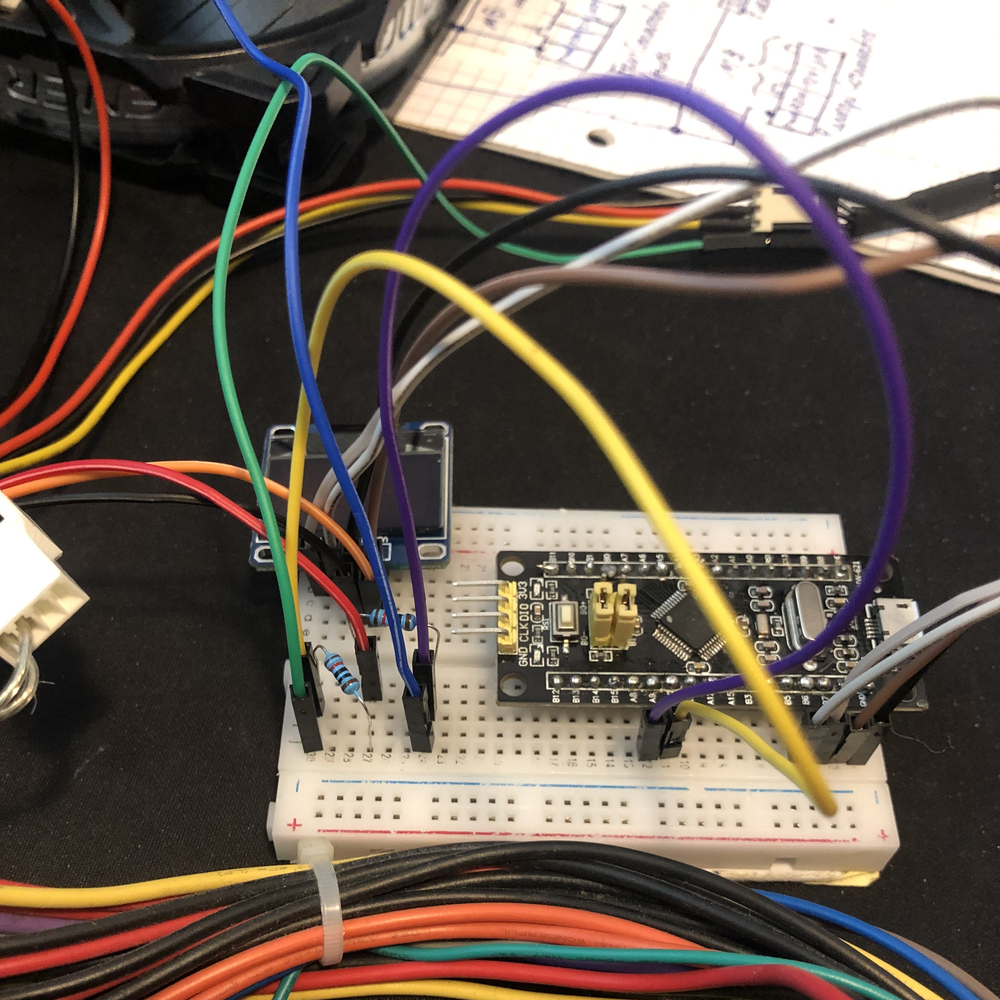
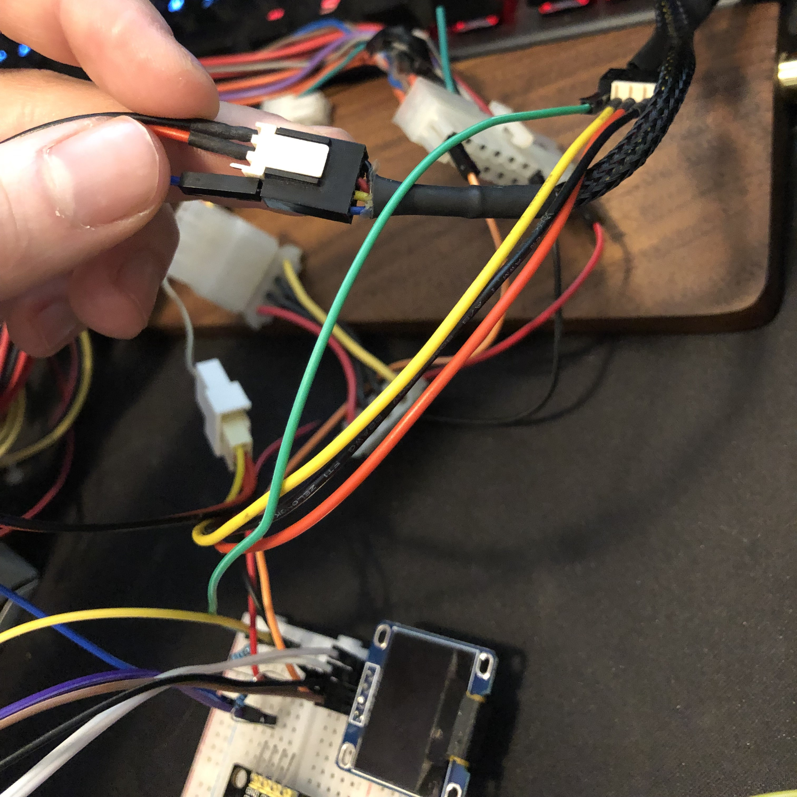
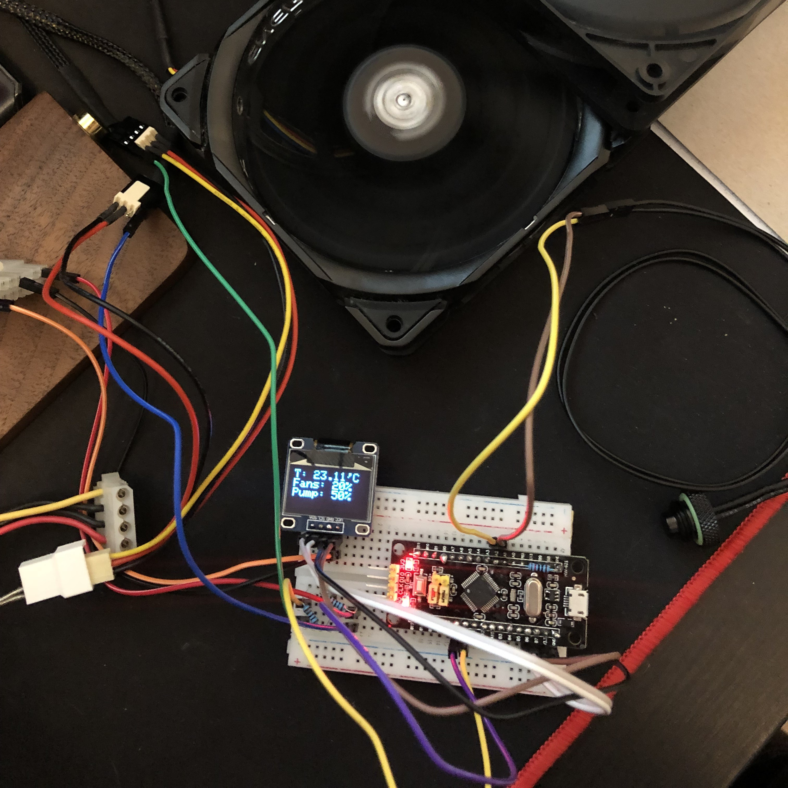
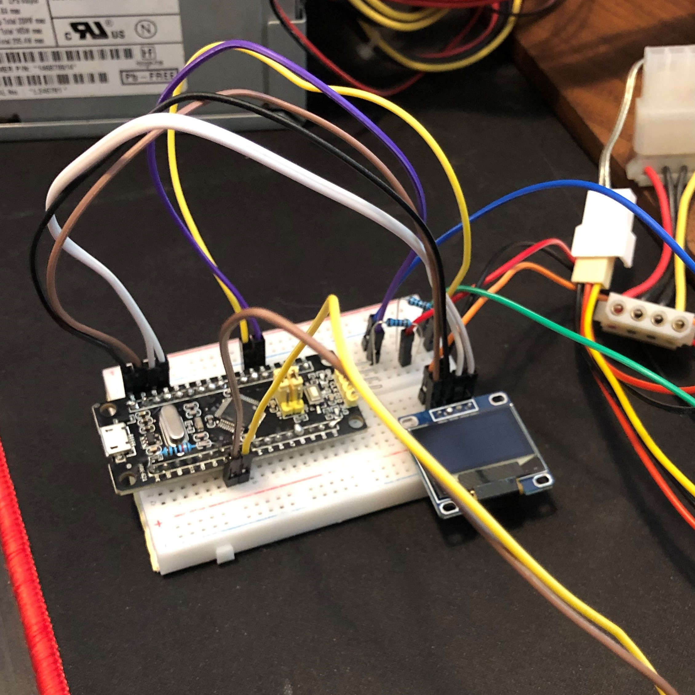
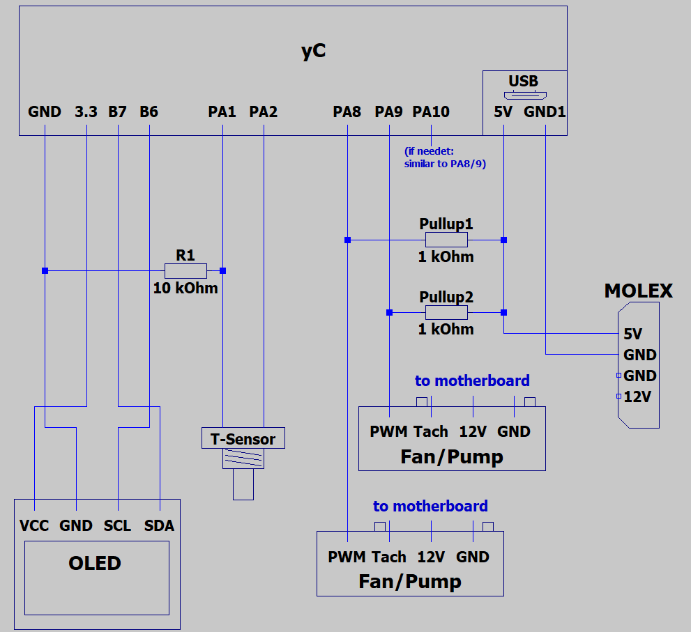
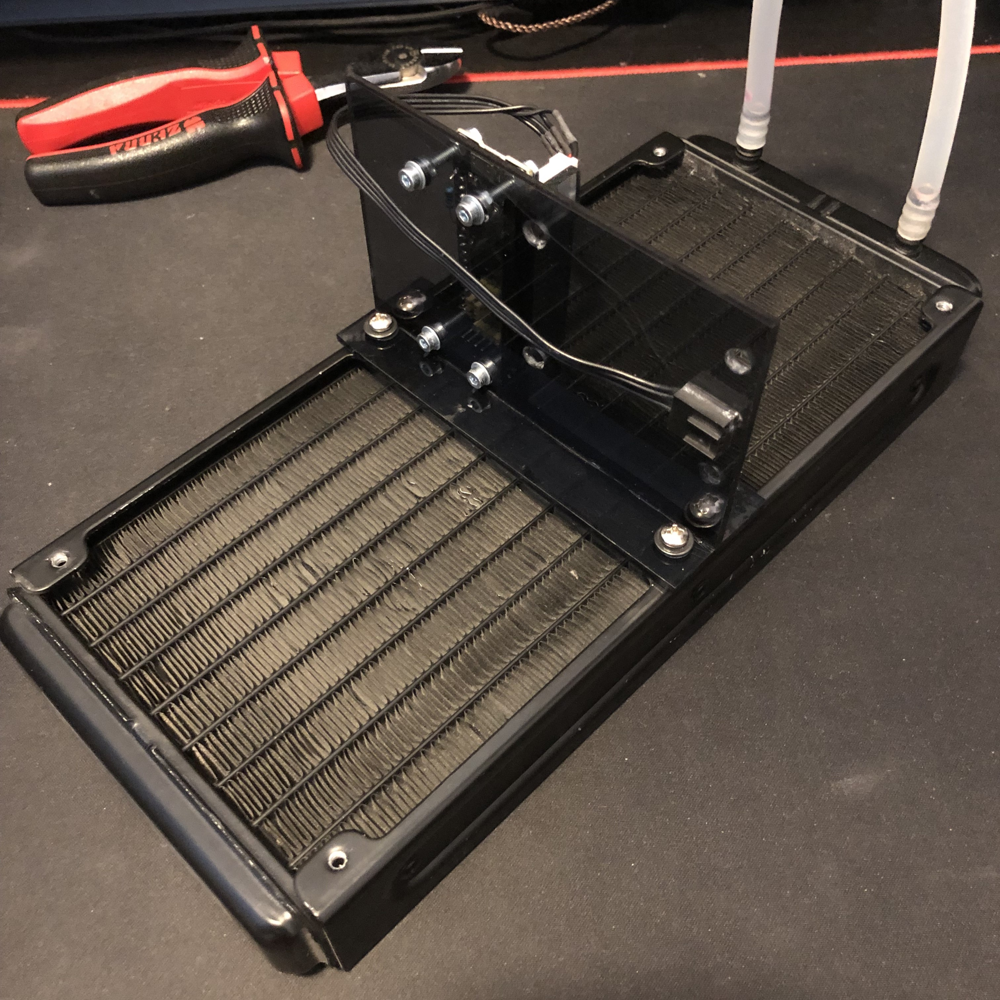
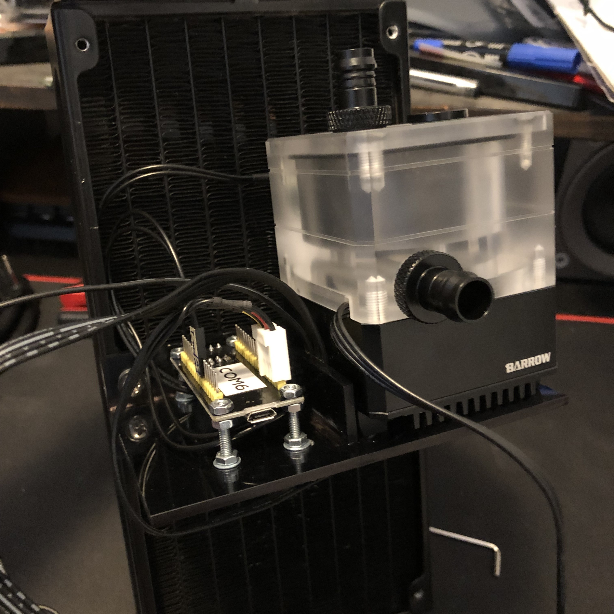

# STM32-BlackPill-FanPumpController
## Introduction
 This Project is about building a controller for PWM fans and pumps with a display, mounting bracket and water temperature sensor. It utilizes a STM32 BlackPill Board (stm32f103c8), which is programmed with STM32duino. This eliminates any drivers and thus load on the system itself and also doesnt require a sensor-header on the motherboard.
 
## 1. Parts Selection
The controller needs to do 3 different tasks:
 - Controll at least 2 PWM fans/pumps
 - Read the temperature from a watercooling temperature sensor
 - Display the information on a little display
 
The chosen Microcontroller is an stm32f103c8, because it is very inexpensive and has more than enough performance for this application. It has 5 5V-tolerant (important) PWM Pins and a 16 bit ADC (analog to digital converter).

As a display the SSD1306 was chosen for very similar reasons and its fitting size.

The temperature sensor and watercooling pump in this case is a Barrow TCWD-V1 and SPB17-TM, but any PWM pump and temperature sensor (thermistor type) with a datasheet should work.

## 2. Planning and Breadboard-Mockup

### PWM Signal Generation

The PWM signal that will be generated has to have a 5V amplitude and a 25 kHz frequency. The information in the signal is transferred through the Duty Cycle of the signal. 
The general specifications and tolance windows are published by noctua in the following white paper: 
https://noctua.at/pub/media/wysiwyg/Noctua_PWM_specifications_white_paper.pdf

Because this microcontroller does not have a high enough logic level to generate this signal by itself (only 3.3V), we have to use a pullup-resistor connected to a 5V line. Then we can run the pins in open drain mode, which gives us the required 5V PWM signal.

From this detailed pinout diagram (and/or the datasheet) we can see which pins we can use and how much current they can sink:
https://github.com/Jedzia/LabDocuments/blob/master/ARM/Black_Pill_Pinout-adv.png

8 mA is the recommendet current, so with a 1 kOhm resisitor there is a 5 mA pullup-current, which is almost perfect.

The display is controlled by the I2C Bus, so it just needs to be connected to power and an SCL and SDA Pin and give the scetch the correct adress. The Adress can be obtained either from the datasheet or by using this scetch: https://learn.adafruit.com/scanning-i2c-addresses/arduino

### Breadboard Mockup PWM

   

### Reading the Temperature Sensor

The temperature sensor is a thermistor, so it measures the temperature by changing its resistance value. The values for this sensor were listed on its product page. To measure resistance with a microcontroller we have to build a voltage divider and measure the voltage dropoff. Details and the kind of circuit that was used can be found in ther following article: https://www.circuitbasics.com/arduino-thermistor-temperature-sensor-tutorial/

### Breadboard Mockup with Temperature Sensor

   

## 3. Final Circuitry

The final circuitry can be seen in the following circuit diagram:

The pullup resistors and connections to the molex and USB connectors were directly soldered into one cable. The resistor for the voltage divider was directly soldered on top of the microcontroller from the pin to a ground connection.

## 4. Mounting Bracket

As the Material for the mounting bracket, acrylic sheets with a thickness of 2,7 mm were chosen. These should be strong enough, non conductive and can be fused together very strongly with cyanoacrylate (super glue). After making a quick technical drawing by hand, the acrylic sheets were scored with a razer blade and broken off to size. Then the fitting holes were drilled and after sanding the edges, they were glued together. To mount the OLED display, an old fan connector was glued to the bottom, in which the pins fit in and hold the screen securely.

    

## 5. Code
